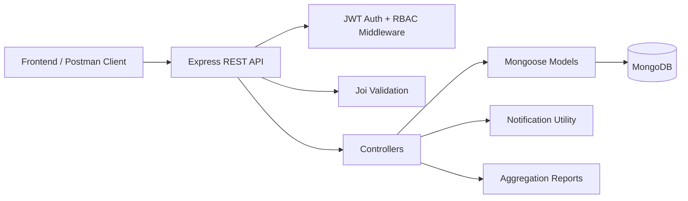
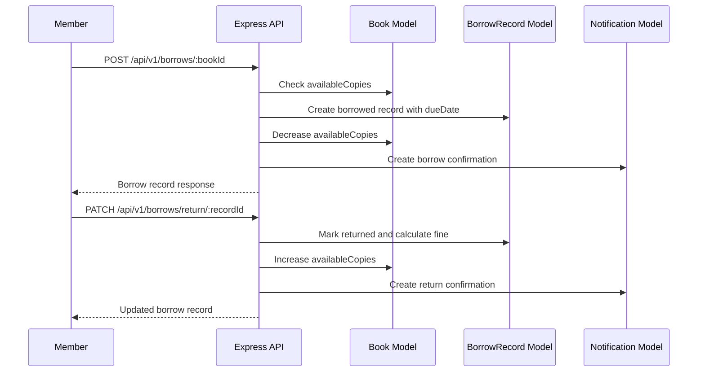
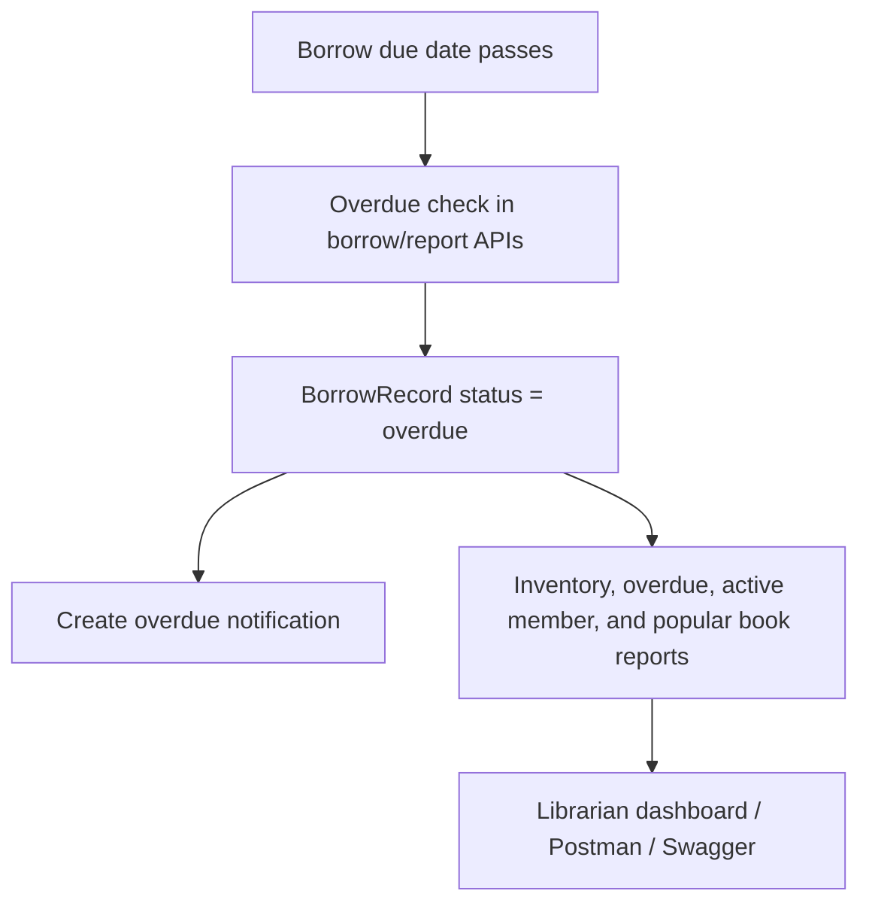
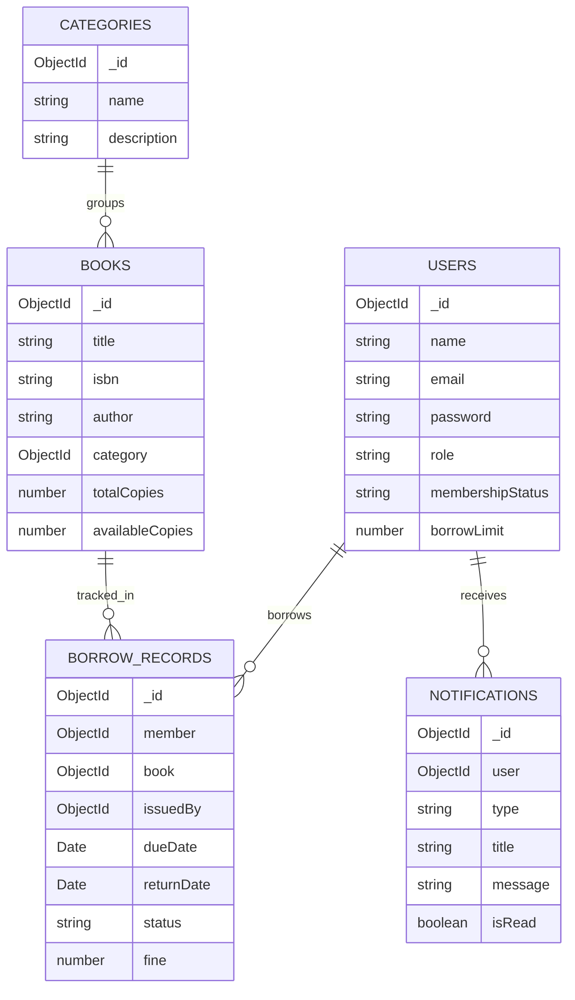

# Architecture Diagram

## Borrowing Flow

## Overdue And Reporting Flow

## Collections

## Access Control

| Role | Permissions |
| --- | --- |
| Librarian | Manage categories, books, members, borrowing on behalf of members, overdue records, and reports |
| Member | Register/login, update profile, search books, borrow available books, return own books, view own history and notifications |
